# Agentic Insurance Claims Processing Demo

An intelligent insurance claims processing system powered by AI agents, demonstrating advanced document processing, policy retrieval, and automated decision-making capabilities using Model Context Protocol (MCP) and LlamaStack.

## ⚠️ IMPORTANT: LlamaStack Version Requirement

**This demo uses LlamaStack v0.3.5+rhai0 as a temporary solution until the next OpenShift AI release.**

**Key URLs** (deployed version):
- Frontend: https://frontend-claims-demo.apps.<OPENSHIFT_CLUSTER_DOMAIN>
- Backend API: https://backend-claims-demo.apps.<OPENSHIFT_CLUSTER_DOMAIN>/api/v1/claims/
- **LlamaStack v0.3.5**: https://llamastack-test-v035-claims-demo.apps.<OPENSHIFT_CLUSTER_DOMAIN>

### LlamaStack Version Roadmap

- **Current (Required)**: v0.3.5+rhai0 - Custom deployment (see deployment steps below)
- **Future**: OpenShift AI 3.0 native LlamaStack - When Red Hat updates to v0.3.5+

## Embedding Model Configuration

The system now uses **Gemma-300m** (768-dim) for generating embeddings instead of Granite-125m:

- **Endpoint**: `https://embeddinggemma-300m-edg-demo.apps.<OPENSHIFT_CLUSTER_DOMAIN>`
- **Vector Store**: LlamaStack with pgvector backend
- **Configured in**: `openshift/llamastack-v0.3.5/llama-stack-config.yaml` (active deployment)

### RAG Architecture Clarification: Builtin vs Custom

⚠️ **The system currently has TWO RAG implementations** (redundant):

1. **`builtin::rag`** - LlamaStack's native RAG runtime
   - Provider: `inline::rag-runtime` (built into LlamaStack)
   - Directly queries pgvector database
   - Simpler but less customizable

2. **`mcp::rag-server`** - Custom MCP server
   - Provider: `remote::model-context-protocol`
   - Python FastAPI server with custom logic
   - More flexible, allows custom filtering and synthesis

**Recommendation**: Use **only ONE** approach. The custom MCP server provides more control for complex business logic.

## Architecture Overview

This demo showcases an end-to-end agentic workflow for insurance claims processing using OpenShift AI and LlamaStack.

### System Architecture

```mermaid
graph TB
    subgraph "User Layer"
        U[👤 User Browser]
    end

    subgraph "OpenShift Cluster"
        subgraph "Application Layer - Namespace: claims-demo"
            F[📱 Frontend<br/>React + TypeScript<br/>Route/Service]
            B[⚙️ Backend API<br/>FastAPI + ReActAgent<br/>Route/Service]
        end

        subgraph "LlamaStack v0.3.5 - Manual Deployment"
            LS[🧠 LlamaStack v0.3.5+rhai0<br/>ReActAgent Runtime<br/>Service: llamastack-test-v035:8321<br/>⚠️ MCP Tools Working!]
        end

        subgraph "OpenShift AI 3.0 - AI Services"

            subgraph "AI Models - InferenceServices"
                LLM["🦙 Llama 3.3 70B INT8<br/>vLLM (4x L40 GPUs)<br/>Context: 20K tokens<br/>Tensor Parallel<br/>Namespace: llama-3-3-70b"]
                EMB["🔢 Gemma 300m<br/>Embeddings (768-dim)<br/>HuggingFace Runtime<br/>Namespace: edg-demo"]
            end

            subgraph "TrustyAI Guardrails"
                LG["🛡️ Llama Guard 3 1B<br/>Content Safety"]
                GG["🛡️ Granite Guardian 3.1 2B<br/>PII Detection"]
            end
        end

        subgraph "MCP Servers - Namespace: claims-demo"
            OCR["📄 OCR MCP Server<br/>EasyOCR Embedded (2-4s)<br/>Service: ocr-server:8080"]
            RAG["🔍 RAG MCP Server Custom<br/>Advanced Vector Retrieval<br/>Service: rag-server:8080"]
            RAGBUILTIN["🔍 Builtin RAG Runtime<br/>LlamaStack Native<br/>inline::rag-runtime"]
        end

        subgraph "Data Layer - Namespace: claims-demo"
            DB[(🗄️ PostgreSQL + pgvector<br/>Claims + Embeddings<br/>StatefulSet + PVC)]
        end
    end

    %% User connections
    U -->|HTTPS| F
    F -->|REST API| B

    %% Backend to LlamaStack
    B -->|Agent API| LS

    %% LlamaStack to Models
    LS -->|Inference| LLM
    LS -->|Embeddings API| EMB
    LS -->|MCP Protocol SSE| OCR
    LS -->|MCP Protocol SSE| RAG
    LS -.->|Optional Safety| LG
    LS -.->|Optional PII Check| GG

    %% LlamaStack Builtin RAG (inline runtime)
    LS -->|Builtin RAG Runtime| RAGBUILTIN
    RAGBUILTIN -->|Direct pgvector Query| DB

    %% MCP Servers to AI Models
    OCR -->|LLM Validation| LLM
    RAG -->|Embeddings via LS API| EMB

    %% Note: EasyOCR runs embedded in OCR server (no external model call)
    %% Note: RAG server calls LlamaStack Embeddings API which uses Gemma 300m

    %% MCP Servers to Data
    RAG -->|Custom Vector Search| DB
    OCR -.->|Store Results| DB

    %% Backend to Data
    B -->|CRUD Operations| DB

    style U fill:#e1f5ff
    style F fill:#fff4e6
    style B fill:#ffe6f0
    style LS fill:#f3e5f5
    style LLM fill:#e8f5e9
    style EMB fill:#e1f5e1
    style LG fill:#fff9c4
    style GG fill:#fff9c4
    style OCR fill:#e3f2fd
    style RAG fill:#e3f2fd
    style RAGBUILTIN fill:#ffeaa7
    style DB fill:#fce4ec
```



### Key Technologies

- **Frontend**: React with TypeScript
- **Backend**: Python FastAPI
- **AI Orchestration**: LlamaStack with ReActAgent (Reasoning + Acting)
- **AI Models**:
  - **Primary LLM**: Llama 3.3 70B INT8 (vLLM inference, 4 GPUs tensor parallel, 20K context)
  - **Embeddings Model**: Gemma 300m (HuggingFace runtime, 768-dim vectors for RAG)
  - **OCR Engine**: EasyOCR (embedded library, fast text extraction)
  - **Guardrails**:
    - Llama Guard 3 1B (content safety detection)
    - Granite Guardian 3.1 2B (HAP, PII detection)
- **MCP Protocol**: Model Context Protocol for tool integration
- **Database**: PostgreSQL with pgvector extension
- **Platform**: Red Hat OpenShift AI 3.0

## Features

### 1. Document Processing (OCR MCP Server)
- **OCR Engine**: EasyOCR (embedded library, 80+ languages support)
- **Performance**: 2-4 seconds per document (fast enough to avoid LlamaStack timeout)
- Automated text extraction from claim documents (PDF, images)
- Multi-format support: PDF, JPG, PNG, TIFF
- Structured data extraction with confidence scores
- LLM validation for accuracy

#### 📝 Architecture Decision: Why EasyOCR instead of Qwen-VL?

**Previous Implementation (Qwen-VL 7B):**
- Large multimodal vision-language model (7 billion parameters)
- Required dedicated GPU deployment via InferenceService
- Processing time: 30+ seconds per document
- **Problem**: Exceeded LlamaStack's 30-second MCP tool timeout → systematic failures

**Current Implementation (EasyOCR):**
- Lightweight embedded library (no external service)
- Processing time: 2-4 seconds per document
- Runs inside the OCR MCP server pod
- Can use GPU if available (optional)
- Specialized for OCR → better accuracy for text extraction

**Trade-offs:**
- ✅ **10x faster** processing (no timeout issues)
- ✅ **Simpler architecture** (no separate InferenceService)
- ✅ **Lower resource usage** (optional GPU, smaller footprint)
- ⚠️ Less "intelligent" than multimodal LLM (but validated by LLM post-processing)

**Note**: Qwen-VL deployment instructions are preserved in [`openshift/qwen-vl-7b/README.md`](openshift/qwen-vl-7b/README.md) for reference. If you need advanced vision understanding beyond OCR, you can still deploy it separately.

### 2. Policy Retrieval (RAG MCP Server)
- Vector similarity search for user contracts
- PostgreSQL + pgvector for efficient retrieval
- Contextual policy information extraction
- Historical claims precedent analysis

### 3. Intelligent Decision Making
- ReActAgent orchestration with thought-action-observation loops
- Multi-step reasoning with tool usage
- Automated claim approval/denial recommendations
- Detailed reasoning with policy citations

### 4. Guardrails & Safety
- PII detection and data protection
- LLM-based content validation
- Configurable safety rules

## Agent Workflow

The system uses a **ReActAgent** (Reasoning and Acting) pattern:

```
1. User submits insurance claim with document
   ↓
2. Agent analyzes the task
   → THOUGHT: "I need to extract information from the document"
   → ACTION: Call OCR MCP tool
   → OBSERVATION: Structured claim data extracted
   ↓
3. Agent continues reasoning
   → THOUGHT: "I need to check user's insurance coverage"
   → ACTION: Call RAG MCP tool to retrieve contracts
   → OBSERVATION: User's active policies and coverage details
   ↓
4. Agent makes final decision
   → THOUGHT: "Based on policy X, section Y, this claim is covered"
   → FINAL ANSWER: Approve with reasoning and estimated coverage
```

## MCP Servers

### MCP Protocol Implementation (JSON-RPC 2.0)

Both OCR and RAG servers implement the **Model Context Protocol (MCP)** using JSON-RPC 2.0 over Server-Sent Events (SSE).

**Protocol Flow**:
1. **Client connects** to `/sse` endpoint → Receives unique session endpoint URL
2. **Client POSTs** JSON-RPC messages to `/sse/message?session_id=<id>`
3. **Server processes** message and queues response
4. **Server sends** response via SSE stream

**Supported JSON-RPC Methods**:
- `initialize` → Returns server info and capabilities
- `tools/list` → Returns available MCP tools
- `tools/call` → Executes a tool with parameters
- `ping` → Keep-alive heartbeat
- `notifications/initialized` → Client ready signal (no response)

**Session Management**: Each SSE connection gets a unique session with 30-second keep-alive.

### OCR Server
**Endpoint**: `http://ocr-server.claims-demo.svc.cluster.local:8080/sse`

**Tools**:
- `ocr_document`: Extract text and structured data from claim documents
  - Supports multiple document types (claim forms, invoices, medical records, ID cards)
  - Multi-language OCR support
  - LLM validation for accuracy

**Health Endpoints**:
- `GET /health/live` → Liveness probe
- `GET /health/ready` → Readiness probe (checks LlamaStack connectivity)

### RAG Server
**Endpoint**: `http://rag-server.claims-demo.svc.cluster.local:8080/sse`

**Tools**:
- `retrieve_user_info`: Get user profile and insurance contracts
- `retrieve_similar_claims`: Find historical claims for precedent
- `search_knowledge_base`: Query policy information and guidelines

**Vector Database**: PostgreSQL with pgvector extension for semantic search

**Health Endpoints**:
- `GET /health/live` → Liveness probe
- `GET /health/ready` → Readiness probe (checks LlamaStack connectivity)

### Guardrails Server
**Endpoint**: `http://claims-guardrails.claims-demo.svc.cluster.local:8080`

**Features**:
- PII detection (SSN, credit cards, emails, phone numbers)
- Sensitive data filtering
- LLM-based validation for context-aware protection

## Deployment

### Prerequisites
- Red Hat OpenShift AI 3.0
- OpenShift cluster with GPU nodes (for vLLM)
- PostgreSQL with pgvector extension

### OpenShift Resources

The deployment uses standard Kubernetes resources (Deployments, Services, ConfigMaps, Routes):

- **LlamaStack v0.3.5**: Manual Deployment (recommended for MCP tools support)
- **MCP Servers**: Standard Deployments for OCR and RAG servers
- **PostgreSQL**: StatefulSet with PVC for persistent storage
- **InferenceService**: KServe-managed vLLM model serving (via OpenShift AI)

**Optional OpenShift AI CRDs** (in `openshift/deployments/`):
- **DataScienceProject**: Creates a data science project namespace with resource quotas
- **LlamaStackDistribution**: Deploys LlamaStack with vector store (Milvus/FAISS) via operator
  - ⚠️ **Technology Preview** in OpenShift AI 3.0 (not supported for production)
  - ⚠️ Supports Milvus/FAISS vector stores (not PostgreSQL/pgvector)
  - We use manual deployment for full control and PostgreSQL/pgvector support

See: [Working with Llama Stack - OpenShift AI 3.0](https://docs.redhat.com/en/documentation/red_hat_openshift_ai_self-managed/3.0/html-single/working_with_llama_stack/)

### Step-by-Step Deployment Guide

#### Step 1: Build Container Images

Before deploying, build container images for all components:

**1.1 Build MCP Servers**
```bash
# Build OCR Server
cd backend/mcp_servers/ocr_server
podman build -t quay.io/your-org/ocr-server:latest .
podman push quay.io/your-org/ocr-server:latest

# Build RAG Server
cd ../rag_server
podman build -t quay.io/your-org/rag-server:latest .
podman push quay.io/your-org/rag-server:latest
```

**1.2 Build Backend API**
```bash
cd ../../..
podman build -t quay.io/your-org/backend:latest -f backend/Dockerfile .
podman push quay.io/your-org/backend:latest
```

**1.3 Build Frontend**
```bash
cd frontend
podman build -t quay.io/your-org/frontend:latest .
podman push quay.io/your-org/frontend:latest
```

#### Step 2: Deploy Database

**2.1 Create PostgreSQL Secret**
```bash
oc create secret generic postgresql-secret \
  --from-literal=POSTGRES_USER=claims_user \
  --from-literal=POSTGRES_PASSWORD=<strong-password> \
  -n claims-demo
```

**2.2 Deploy PostgreSQL + pgvector**
```bash
oc apply -f openshift/pvcs/postgresql-pvc.yaml
oc apply -f openshift/deployments/postgresql-statefulset.yaml
oc apply -f openshift/services/postgresql-service.yaml
```

**2.3 Wait for PostgreSQL to be ready**
```bash
oc wait --for=condition=ready pod -l app=postgresql --timeout=300s
```

**2.4 Initialize Database Schema**
```bash
# Copy init.sql to pod
oc cp database/init.sql postgresql-0:/tmp/init.sql

# Execute schema creation
oc exec postgresql-0 -- psql -U claims_user -d claims_db -f /tmp/init.sql
```

**2.5 Seed Test Data**
```bash
# Copy seed data
oc cp database/seed_data/001_sample_data.sql postgresql-0:/tmp/seed.sql

# Execute seed script
oc exec postgresql-0 -- psql -U claims_user -d claims_db -f /tmp/seed.sql

# Verify data
oc exec postgresql-0 -- psql -U claims_user -d claims_db -c "SELECT COUNT(*) FROM users;"
oc exec postgresql-0 -- psql -U claims_user -d claims_db -c "SELECT COUNT(*) FROM claims;"
```

#### Step 3: Deploy vLLM Inference Model

**3.1 Deploy Llama 3.3 70B INT8 with vLLM (4 GPUs tensor parallel, 20K context)**
```bash
cd openshift/deployments/llama-3-3-70B
./deploy.sh
```

**3.2 Wait for model to load** (takes ~10 minutes)
```bash
oc wait --for=condition=ready pod -l app=llama-3-3-70b-predictor -n llama-3-3-70b --timeout=900s
```

**3.3 Verify vLLM health**
```bash
oc logs -l app=llama-3-3-70b-predictor -n llama-3-3-70b --tail=50
```

#### Step 4: Deploy TrustyAI Guardrails

**4.1 Deploy Guardrails Models (Optional - for PII detection and content safety)**
```bash
# Deploy Llama Guard 3 1B - Content safety detection
oc apply -f openshift/guardrails/detector-inferenceservice.yaml

# Deploy Granite Guardian 3.1 2B - HAP and PII detection
oc apply -f openshift/guardrails/granite-guardian-inferenceservice.yaml

# Deploy Llama Guard detector (alternative safety model)
oc apply -f openshift/guardrails/llama-guard-inferenceservice.yaml
```

**Note**: These models provide multi-layered protection:
- **Llama Guard 3 1B**: Detects unsafe content, hate speech, violence
- **Granite Guardian 3.1 2B**: IBM model for PII detection (SSN, credit cards, emails)

**4.2 Deploy Guardrails Configuration**
```bash
# Configure guardrails rules
oc apply -f openshift/guardrails/guardrails-config.yaml

# Deploy guardrails orchestrator
oc apply -f openshift/guardrails/guardrails-orchestrator.yaml
```

**4.3 Verify Guardrails**
```bash
oc get pods -l app=guardrails
oc logs -l app=guardrails-orchestrator --tail=20
```

#### Step 5: LlamaStack v0.3.5 Deployment

⚠️ **CRITICAL**: You MUST use LlamaStack v0.3.5+rhai0 or later. Earlier versions have broken MCP tool execution.

**Why NOT use OpenShift AI 3.0 native LlamaStack?**
- OpenShift AI 3.0 currently ships with LlamaStack v0.3.0-v0.3.4
- These versions have critical bugs with MCP tool calls
- We deploy LlamaStack v0.3.5+rhai0 **manually** until OpenShift AI updates

**5.1 Create LlamaStack Configuration ConfigMap**

Create a ConfigMap with the LlamaStack v0.3.5 configuration including MCP tools:

```bash
# Apply the ConfigMap with MCP tools configuration
oc apply -f openshift/llamastack-v0.3.5/llama-stack-config.yaml -n claims-demo
```

**Configuration Contents** (`llama-stack-config.yaml`):

```yaml
apiVersion: v1
kind: ConfigMap
metadata:
  name: llama-stack-config-v035
  namespace: claims-demo
data:
  run.yaml: |
    version: "2"

    # Built-in providers (inline)
    built_in_providers:
      - remote::ollama           # For local Ollama models
      - inline::meta-reference   # Meta reference agents
      - remote::fireworks        # Fireworks AI
      - remote::together         # Together AI
      - inline::pgvector         # Vector DB (pgvector)
      - inline::rag-runtime      # Builtin RAG
      - remote::model-context-protocol  # MCP provider

    # Model providers
    models:
      - provider_id: vllm-inference-1
        provider_type: remote::vllm
        config:
          url: "https://llama-3-3-70b-llama-3-3-70b.apps.CLUSTER_DOMAIN/v1"

    # MCP Tool Groups (CRITICAL for v0.3.5)
    toolgroups:
      - toolgroup_id: mcp::ocr-server
        provider_id: model-context-protocol
        provider_type: remote::model-context-protocol
        mcp_endpoint:
          uri: "http://ocr-server.claims-demo.svc.cluster.local:8080/sse"

      - toolgroup_id: mcp::rag-server
        provider_id: model-context-protocol
        provider_type: remote::model-context-protocol
        mcp_endpoint:
          uri: "http://rag-server.claims-demo.svc.cluster.local:8080/sse"

    # Agents runtime
    agents:
      - provider_id: meta-reference
        provider_type: inline::meta-reference
        config: {}

    # Vector DB for RAG
    memory_banks:
      - provider_id: pgvector
        provider_type: inline::pgvector
        config:
          host: "postgresql.claims-demo.svc.cluster.local"
          port: 5432
          db: "claims_db"
          user: "claims_user"
          password: "${POSTGRES_PASSWORD}"
```

**5.2 Create LlamaStack Deployment (v0.3.5)**

Create a Deployment manifest for LlamaStack v0.3.5:

```yaml
apiVersion: apps/v1
kind: Deployment
metadata:
  name: llamastack-test-v035
  namespace: claims-demo
spec:
  replicas: 1
  selector:
    matchLabels:
      app: llamastack-v035
  template:
    metadata:
      labels:
        app: llamastack-v035
    spec:
      containers:
      - name: llama-stack
        image: docker.io/llamastack/distribution-rh-dev:0.3.5+rhai0
        ports:
        - containerPort: 8321
          name: http
        env:
        - name: POSTGRES_PASSWORD
          valueFrom:
            secretKeyRef:
              name: postgresql-secret
              key: POSTGRES_PASSWORD
        volumeMounts:
        - name: config
          mountPath: /app/run.yaml
          subPath: run.yaml
        livenessProbe:
          httpGet:
            path: /health
            port: 8321
          initialDelaySeconds: 30
          periodSeconds: 10
        readinessProbe:
          httpGet:
            path: /health
            port: 8321
          initialDelaySeconds: 10
          periodSeconds: 5
      volumes:
      - name: config
        configMap:
          name: llama-stack-config-v035
```

Deploy LlamaStack v0.3.5:

```bash
# Apply the deployment
oc apply -f openshift/llamastack-v0.3.5/deployment.yaml -n claims-demo

# Create the service
oc apply -f openshift/llamastack-v0.3.5/service.yaml -n claims-demo

# Create the route
oc apply -f openshift/llamastack-v0.3.5/route.yaml -n claims-demo
```

**5.3 Wait for LlamaStack to be Ready**

```bash
# Wait for the pod to be ready
oc wait --for=condition=ready pod -l app=llamastack-v035 -n claims-demo --timeout=300s

# Check the logs
oc logs -l app=llamastack-v035 -n claims-demo --tail=50

# Verify the service
oc get svc llamastack-test-v035 -n claims-demo
```

**5.4 Verify MCP Tools Registration (v0.3.5 API)**

Verify that MCP servers are properly registered using the new v0.3.5 toolgroups API:

```bash
# Get the LlamaStack route
LLAMASTACK_URL=$(oc get route llamastack-test-v035 -n claims-demo -o jsonpath='{.spec.host}')

# List registered tool groups
curl -s "https://${LLAMASTACK_URL}/v1/toolgroups" | jq .
```

Expected output:
```json
{
  "toolgroups": [
    {
      "identifier": "mcp::ocr-server",
      "provider_resource_id": "model-context-protocol",
      "type": "mcp"
    },
    {
      "identifier": "mcp::rag-server",
      "provider_resource_id": "model-context-protocol",
      "type": "mcp"
    }
  ]
}
```

**5.5 Test MCP Tool Execution**

Test that MCP tools can be called successfully:

```bash
# Create a test agent
curl -X POST "https://${LLAMASTACK_URL}/v1/agents" \
  -H "Content-Type: application/json" \
  -d '{
    "agent_id": "test-agent",
    "model": "vllm-inference-1/llama-3-3-70b",
    "instructions": "You are a helpful assistant.",
    "toolgroups": ["mcp::ocr-server", "mcp::rag-server"]
  }'

# The agent should be created successfully with MCP tools registered
```

**5.6 Updating LlamaStack Configuration**

To update the LlamaStack configuration:

```bash
# 1. Update the ConfigMap
oc edit configmap llama-stack-config-v035 -n claims-demo

# 2. Restart LlamaStack pod to reload configuration
oc delete pod -l app=llamastack-v035 -n claims-demo

# 3. Wait for new pod to be ready
oc wait --for=condition=ready pod -l app=llamastack-v035 -n claims-demo --timeout=300s

# 4. Verify the new configuration
oc logs -l app=llamastack-v035 -n claims-demo --tail=50
```

📚 **Documentation**:
- [LlamaStack v0.3.5 Release Notes](https://github.com/meta-llama/llama-stack/releases/tag/v0.3.5)
- [LlamaStack MCP Provider Documentation](https://github.com/meta-llama/llama-stack/blob/main/docs/source/distributions/remote_mcp.md)
- [Future: OpenShift AI 3.0 - Working with Llama Stack](https://docs.redhat.com/en/documentation/red_hat_openshift_ai_self-managed/3.0/html-single/working_with_llama_stack/) (when updated to v0.3.5+)

#### Step 6: OCR Configuration - EasyOCR (Default)

⚠️ **Important Change**: The OCR MCP Server now uses **EasyOCR** (embedded library) instead of Qwen-VL 7B.

**Why the change?**
- **Performance**: EasyOCR processes documents in 2-4 seconds vs 30+ seconds for Qwen-VL
- **Reliability**: No timeout issues (LlamaStack has a 30-second MCP tool timeout)
- **Simplicity**: No external InferenceService required - OCR runs inside the MCP server pod
- **Resources**: Optional GPU usage, much smaller footprint

**No additional deployment needed** - EasyOCR is installed automatically when deploying the OCR MCP server.

**Configuration**:
```bash
# EasyOCR language support (default: English + French)
# Edit OCR server deployment to add more languages if needed
oc set env deployment/ocr-server OCR_LANGUAGES=en,fr,es,de -n claims-demo
```

**Supported languages**: 80+ languages including English, French, Spanish, German, Chinese, Arabic, etc.

---

#### Step 6 (Alternative): Deploy Qwen-VL 7B for Advanced Vision (Optional - Not Recommended)

**⚠️ Deprecated for OCR**: Qwen-VL is no longer used by default due to performance issues (30+ second processing time exceeds LlamaStack timeout).

**When to use Qwen-VL**: Only if you need advanced vision understanding beyond text extraction (e.g., image analysis, visual question answering).

Deployment instructions preserved for reference: [`openshift/qwen-vl-7b/README.md`](openshift/qwen-vl-7b/README.md)

**Requirements**: 1 GPU (L40 or equivalent with 24GB+ VRAM) + ~30GB storage.

#### Step 7: Deploy MCP Servers

**7.1 Deploy OCR Server**
```bash
oc apply -f openshift/deployments/ocr-server-deployment.yaml
oc apply -f openshift/services/ocr-server-service.yaml
```

**7.2 Deploy RAG Server**
```bash
oc apply -f openshift/deployments/rag-server-deployment.yaml
oc apply -f openshift/services/rag-server-service.yaml
```

**7.3 Verify MCP Servers**
```bash
oc get pods -l component=mcp-server
oc logs -l app=ocr-server --tail=20
oc logs -l app=rag-server --tail=20
```

#### Step 8: Deploy Backend API

**8.1 Create Backend ConfigMaps**
```bash
oc apply -f openshift/configmaps/backend-config.yaml
oc apply -f openshift/configmaps/prompts-config.yaml
```

**8.2 Deploy Backend**
```bash
oc apply -f openshift/deployments/backend-deployment.yaml
oc apply -f openshift/services/backend-service.yaml
oc apply -f openshift/routes/backend-route.yaml
```

**8.3 Verify Backend**
```bash
oc get pods -l app=backend
oc logs -l app=backend --tail=50

# Test health endpoint
BACKEND_URL=$(oc get route backend -o jsonpath='{.spec.host}')
curl http://$BACKEND_URL/health
```

#### Step 9: Deploy Frontend (Optional)

**Note**: The frontend is primarily deployed via Helm chart. For manual deployment, you'll need to create service and route manifests.

**9.1 Deploy Frontend (if deploying manually)**
```bash
oc apply -f openshift/deployments/frontend-deployment.yaml
# Note: Service and Route manifests are in the Helm chart
# See: helm/agentic-claims-demo/templates/frontend/
```

**9.2 Get Frontend URL (if using Helm)**
```bash
FRONTEND_URL=$(oc get route frontend -n claims-demo -o jsonpath='{.spec.host}')
echo "Access the application at: https://$FRONTEND_URL"
```

#### Step 10: Test End-to-End Workflow

**10.1 Access the Frontend**
```bash
# Open browser to frontend URL
echo "Application URL: http://$(oc get route frontend -o jsonpath='{.spec.host}')"
```

**10.2 Test Claims Processing via API**
```bash
# Get a sample claim ID from database
CLAIM_ID=$(oc exec postgresql-0 -- psql -U claims_user -d claims_db -t -c \
  "SELECT id FROM claims WHERE status='pending' LIMIT 1;")

# Process claim via API
BACKEND_URL=$(oc get route backend -o jsonpath='{.spec.host}')
curl -X POST "http://$BACKEND_URL/api/v1/claims/${CLAIM_ID}/process" \
  -H "Content-Type: application/json" \
  -d '{"skip_ocr": false, "enable_rag": true}'

# Check processing status
curl "http://$BACKEND_URL/api/v1/claims/${CLAIM_ID}/status"
```

**10.3 Monitor Processing**
```bash
# Watch backend logs
oc logs -f -l app=backend

# Watch LlamaStack logs for ReActAgent activity
oc logs -f -l app=llama-stack | grep -i "thought\|action\|observation"
```

#### Step 11: Create Demo Claims

**11.1 Reset Database and Create Test Claims**

The `reset_and_create_claims.sh` script provides an easy way to clean the database and create fresh demo claims:

```bash
# Run the reset script to:
# - Delete all existing claims, decisions, and logs
# - Create 10 fresh pending claims with different outcomes
cd scripts
./reset_and_create_claims.sh
```

**What the script creates**:
- **10 pending claims** ready for processing
- **Claims 1, 4, 7, 9**: user_001 (has contracts) → Should **APPROVE**
- **Claims 2, 5, 8**: user_002 (has contracts) → Should **APPROVE**
- **Claims 3, 6, 10**: user_003 (no contracts) → Should **MANUAL_REVIEW**

**11.2 Process a Specific Claim**

After running the reset script, you can process any claim using its ID displayed by the script:

```bash
# Get claim ID from script output (e.g., CLM-2026-AUTO-001)
CLAIM_ID="<claim-id-from-script>"

# Process the claim via API
BACKEND_URL=$(oc get route backend -o jsonpath='{.spec.host}')
curl -X POST "https://${BACKEND_URL}/api/v1/claims/${CLAIM_ID}/process" \
  -H "Content-Type: application/json" \
  -d '{"workflow_type": "standard", "skip_ocr": false, "enable_rag": true}'

# Monitor the claim status
curl "https://${BACKEND_URL}/api/v1/claims/${CLAIM_ID}/status" | jq
```

**11.3 Process All Demo Claims**

To process all 10 demo claims sequentially:

```bash
# Get all pending claim IDs
CLAIM_IDS=$(oc exec postgresql-0 -n claims-demo -- psql -U claims_user -d claims_db -t -c \
  "SELECT id FROM claims WHERE status='pending' ORDER BY claim_number;")

# Process each claim
for CLAIM_ID in $CLAIM_IDS; do
  echo "Processing claim: $CLAIM_ID"
  curl -X POST "https://${BACKEND_URL}/api/v1/claims/${CLAIM_ID}/process" \
    -H "Content-Type: application/json" \
    -d '{"skip_ocr": false, "enable_rag": true}'
  sleep 5  # Wait between claims
done
```

### Configuration

Key configuration is externalized via ConfigMaps:

- **Backend Config**: `openshift/configmaps/backend-config.yaml`
  - API settings, database connections, LlamaStack endpoints

- **LlamaStack Config v0.3.5**: `openshift/llamastack-v0.3.5/llama-stack-config.yaml`
  - Model configurations (Llama 3.3 70B + Gemma 300m), tool groups, MCP server endpoints
  - PostgreSQL storage backend

- **LlamaStack Config v0.3.0** (Reference): `openshift/configmaps/llamastack-config.yaml`
  - Configuration for OpenShift AI shipped LlamaStack (Llama 3.2 3B + Mistral 14B)
  - SQLite storage backend

- **Prompts**: `openshift/configmaps/prompts-config.yaml`
  - Agent instructions and system prompts

## API Endpoints

### Backend REST API

**Base URL**: `http://backend-service.claims-demo.svc.cluster.local:8000/api/v1`

**Main Endpoints**:
- `GET /claims` - List all claims
- `POST /claims` - Create new claim
- `GET /claims/{id}` - Get claim details
- `POST /claims/{id}/process` - Process claim with AI agent
- `GET /claims/{id}/status` - Get processing status
- `GET /claims/{id}/decision` - Get AI decision and reasoning

## Development

### Local Setup

1. **Backend**:
```bash
cd backend
python -m venv venv
source venv/bin/activate
pip install -r requirements.txt
uvicorn app.main:app --reload
```

2. **Frontend**:
```bash
cd frontend
npm install
npm start
```

3. **Database** (via Docker Compose):
```bash
docker-compose up -d postgresql
```

### Environment Variables

Required environment variables for local development:

```bash
# Database
POSTGRES_HOST=localhost
POSTGRES_PORT=5432
POSTGRES_DB=claims_db
POSTGRES_USER=claims_user
POSTGRES_PASSWORD=your_password

# LlamaStack
LLAMASTACK_ENDPOINT=http://localhost:8321
LLAMASTACK_DEFAULT_MODEL=vllm-inference-1/llama-3-3-70b

# MCP Servers
OCR_SERVER_URL=http://localhost:8080
RAG_SERVER_URL=http://localhost:8081
```

## Project Structure

```
agentic-claim-demo/
├── backend/
│   ├── app/
│   │   ├── api/              # FastAPI endpoints
│   │   │   ├── claims.py     # Claims processing API
│   │   │   └── schemas.py    # Pydantic models
│   │   ├── core/             # Core configuration
│   │   │   ├── config.py     # Settings management
│   │   │   └── database.py   # Database connections
│   │   ├── models/           # SQLAlchemy models
│   │   │   └── claim.py      # Claim data models
│   │   └── llamastack/       # LlamaStack integration
│   │       └── prompts.py    # Agent prompts
│   └── mcp_servers/          # Custom MCP servers
│       ├── ocr_server/
│       └── rag_server/
├── frontend/
│   └── src/
│       ├── components/       # React components
│       ├── pages/            # Page components
│       └── services/         # API clients
├── openshift/                # OpenShift deployment manifests
│   ├── configmaps/           # Configuration (backend, prompts, llamastack v0.3.0)
│   ├── deployments/          # Deployments and CRDs
│   ├── services/             # Service definitions
│   ├── routes/               # OpenShift routes
│   ├── pvcs/                 # Persistent volume claims
│   ├── guardrails/           # TrustyAI guardrails
│   └── llamastack-v0.3.5/    # LlamaStack v0.3.5 custom deployment
├── helm/                     # Helm chart for automated deployment
│   └── agentic-claims-demo/
├── database/
│   ├── init.sql              # Database schema
│   ├── seed_data/            # Sample data
│   └── migrations/           # Database migrations
└── scripts/                  # Deployment and testing scripts
```

## Technology Stack Details

### Backend Stack
- **Python 3.12**
- **FastAPI**: Modern async web framework
- **SQLAlchemy**: ORM with async support
- **Pydantic**: Data validation
- **llama-stack-client 0.3.5**: LlamaStack SDK
- **asyncpg**: Async PostgreSQL driver

### Frontend Stack
- **React 18**
- **TypeScript**
- **Axios**: HTTP client
- **React Router**: Navigation

### AI & ML Stack
- **LlamaStack**: AI orchestration platform
- **vLLM**: High-performance LLM inference
- **Llama 3.3 70B INT8**: Language model (20K context window, tensor parallel)
- **pgvector**: Vector similarity search
- **MCP Protocol**: Standardized tool integration

## Performance Considerations

### vLLM Configuration
- **GPUs**: 4x NVIDIA L40 (48GB each) = 192GB total VRAM
- **Tensor Parallelism**: TP=4 for model distribution across GPUs
- **Quantization**: INT8 model weights + FP8 KV cache
- **Context Length**: 20K tokens
- **GPU Memory Utilization**: 75% (optimized for stability)
- **Per-GPU Usage**: ~24-26GB (model + KV cache + activations)

### Database Optimization
- **pgvector HNSW Index**: Fast similarity search
- **Connection Pooling**: 10 connections, 20 max overflow
- **Async Operations**: Non-blocking database queries

## Security

- **Input Validation**: All inputs validated via Pydantic schemas
- **PII Protection**: Guardrails for sensitive data detection
- **CORS**: Configurable allowed origins
- **Secret Management**: OpenShift Secrets for credentials
- **Network Isolation**: Internal service communication
