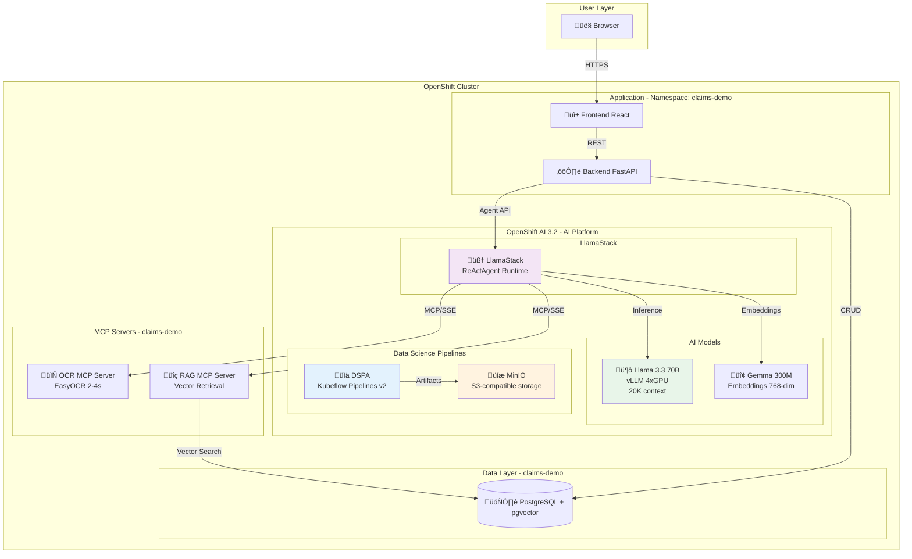

# Agentic Insurance Claims Processing Demo

An intelligent insurance claims processing system powered by AI agents, demonstrating advanced document processing, policy retrieval, and automated decision-making capabilities using Model Context Protocol (MCP) and LlamaStack on Red Hat OpenShift AI.

## 📋 Table of Contents

- [Overview](#overview)
- [Architecture](#architecture)
- [Prerequisites](#prerequisites)
- [Quick Start (Helm)](#quick-start-helm)
- [Configuration](#configuration)
- [Advanced Topics](#advanced-topics)
- [Development](#development)
- [Troubleshooting](#troubleshooting)
- [API Reference](#api-reference)

## Overview

### What is this?

This demo showcases an end-to-end agentic workflow for insurance claims processing:

1. **Document Processing**: Extract structured data from claim documents (PDFs, images) using OCR
2. **Policy Retrieval**: Semantic search through user contracts and historical claims using RAG (Retrieval-Augmented Generation)
3. **Intelligent Decision-Making**: ReActAgent (Reasoning + Acting) orchestration for multi-step reasoning with automated claim approval/denial

### Key Features

- ✅ **Agentic Workflow**: LlamaStack Responses API with automatic tool execution
- 🔧 **MCP Tools**: Custom OCR and RAG servers using Model Context Protocol
- 🤖 **AI Models**: Llama 3.3 70B (reasoning) + Gemma 300M (embeddings)
- 📄 **OCR**: Fast document processing (2-4s per document) with EasyOCR
- 🔍 **RAG**: Vector similarity search with PostgreSQL pgvector
- 🛡️ **PII Detection**: TrustyAI Guardrails with LlamaStack shields integration
- 👤 **HITL**: Human-in-the-Loop review with Ask Agent for manual review cases
- 🏗️ **Service Architecture**: Clean separation of business logic and API layers
- 🚀 **Production-Ready**: Helm deployment with MinIO + Data Science Pipelines

## Architecture

### System Components



### Technology Stack

**AI & ML**:
- **LlamaStack 0.3.5**: AI orchestration with ReActAgent
- **Llama 3.3 70B INT8**: Primary LLM (vLLM, 4 GPUs tensor parallel, 20K context)
- **Gemma 300M**: Embeddings model (768-dim vectors)
- **EasyOCR**: Fast OCR engine (2-4s per document)
- **PostgreSQL pgvector**: Vector similarity search

**Application**:
- **Backend**: Python 3.12 + FastAPI
- **Frontend**: React 18 + TypeScript
- **MCP Protocol**: Model Context Protocol for tool integration

**Platform**:
- **Red Hat OpenShift AI 3.2**: AI platform and operators
- **Kubeflow Pipelines v2**: Data Science Pipelines (DSPA)
- **MinIO**: S3-compatible object storage
- **Helm 3.x**: Package management

## Workflows

### Automated Claim Processing

The system processes claims through an intelligent multi-step workflow:

1. **OCR Processing** (`ocr_document` MCP tool)
   - Extract text and structured data from PDF documents
   - Process in 2-4 seconds per document
   - Store raw OCR text and confidence scores

2. **User Information Retrieval** (`retrieve_user_info` MCP tool)
   - Vector search through user contracts using embeddings
   - Retrieve coverage limits, deductibles, and policy terms
   - Rank contracts by relevance to claim

3. **Similar Claims Analysis** (`retrieve_similar_claims` MCP tool)
   - Find historical claims with similar characteristics
   - Use vector similarity search on claim embeddings
   - Provide precedents and patterns for decision-making

4. **Knowledge Base Search** (`search_knowledge_base` MCP tool)
   - Query policy documents and guidelines
   - Retrieve relevant clauses and procedures
   - Support decision with authoritative sources

5. **Automated Decision**
   - LlamaStack agent analyzes all gathered information
   - Generates structured recommendation (approve/deny/manual_review)
   - Provides confidence score and reasoning
   - Stores decision with full audit trail

### PII Detection (Post-Processing)

After claim processing completes, the system runs PII detection:

- **TrustyAI Guardrails Shield**: Detects sensitive information in OCR and RAG outputs
- **Detection Types**: Email addresses, phone numbers, dates of birth, license plates
- **Non-Blocking**: Logs detections without blocking claim processing
- **Audit Trail**: Records in `guardrails_detections` table with:
  - Source step (OCR, RAG retrieval)
  - Detected fields
  - Confidence scores
  - Action taken (logged, flagged, etc.)

### Human-in-the-Loop (HITL) Review

For claims requiring manual review:

1. **Manual Review Interface**
   - Claims with `manual_review` status display review panel
   - Shows system decision, confidence, and reasoning
   - Displays all processing steps and outputs

2. **Ask Agent Feature**
   - Reviewers can ask clarifying questions to the AI agent
   - Agent provides context-aware answers using claim data
   - Full conversation history maintained in `agent_logs`

3. **Final Decision**
   - Reviewer approves or denies with notes
   - System tracks both initial AI decision and final human decision
   - Preserves full decision history:
     - Initial decision (system)
     - Final decision (reviewer)
     - Decision maker and timestamp
     - Review notes

### Service Architecture

The backend uses a clean service-oriented architecture:

```
app/
├── api/                    # FastAPI endpoints (thin layer)
│   ├── claims.py          # Claim operations
│   └── hitl.py            # Manual review endpoints
├── services/              # Business logic layer
│   ├── claim_service.py   # Claim processing orchestration
│   └── agent/             # AI agent services
│       ├── responses_orchestrator.py  # LlamaStack Responses API
│       ├── context_builder.py         # Build processing contexts
│       ├── response_parser.py         # Parse AI responses
│       └── reviewer.py                # HITL review logic
└── models/                # Database models (SQLAlchemy)
```

**Benefits**:
- Clear separation of concerns
- Testable business logic
- Reusable agent components
- Easy to mock for testing

## Prerequisites

### Required

1. **OpenShift 4.14+** cluster with:
   - GPU nodes for AI models (4x L40 or equivalent for Llama 70B)
   - Dynamic storage provisioning

2. **Red Hat OpenShift AI 3.2**:
   - Operator installed and running
   - ServingRuntime for vLLM configured
   - LlamaStack operator enabled

3. **Helm 3.x**:
   ```bash
   helm version
   ```

4. **oc CLI**:
   ```bash
   oc version
   ```

### Accounts & Tokens

- **HuggingFace token** (for model downloads): https://huggingface.co/settings/tokens
- **Container registry** credentials (Quay.io, Docker Hub, or internal registry)

### Optional

- **GitOps** (ArgoCD/Flux) for automated deployments
- **GPU Operator** if not pre-installed

## Quick Start (Helm)

### 1. Build and Push Images

Build all container images and push to your registry:

```bash
# Set your registry
export REGISTRY=quay.io/your-org
export TAG=v1.7.2

# Backend (build from parent directory for correct COPY paths)
cd /path/to/agentic-claim-demo
podman build --platform linux/amd64 \
  -t $REGISTRY/backend:$TAG \
  -f backend/Dockerfile .
podman push $REGISTRY/backend:$TAG

# Frontend (build sources first, then package with nginx)
cd frontend
npm run build
podman build --platform linux/amd64 \
  -t $REGISTRY/frontend:$TAG \
  -f Dockerfile.production .
podman push $REGISTRY/frontend:$TAG
cd ..

# MCP Servers
podman build --platform linux/amd64 \
  -t $REGISTRY/ocr-server:$TAG \
  backend/mcp_servers/ocr_server/
podman push $REGISTRY/ocr-server:$TAG

podman build --platform linux/amd64 \
  -t $REGISTRY/rag-server:$TAG \
  backend/mcp_servers/rag_server/
podman push $REGISTRY/rag-server:$TAG

# Database with pgvector
podman build --platform linux/amd64 \
  -t $REGISTRY/postgresql-pgvector:$TAG \
  database/
podman push $REGISTRY/postgresql-pgvector:$TAG

# HuggingFace CLI helper
podman build --platform linux/amd64 \
  -t $REGISTRY/hfcli:$TAG \
  backend/hfcli/
podman push $REGISTRY/hfcli:$TAG
```

### 2. Configure Values

Create your custom values file from the sample:

```bash
cd helm/agentic-claims-demo
cp values-sample.yaml values-mydeployment.yaml
```

Edit `values-mydeployment.yaml`:

```yaml
# Update image repositories
backend:
  image:
    repository: quay.io/your-org/backend
    tag: latest

# Set cluster domain for model endpoints
inference:
  endpoint: "https://llama-3-3-70b-llama-3-3-70b.apps.YOUR-CLUSTER-DOMAIN/v1"

embedding:
  endpoint: "https://embeddinggemma-300m-embeddinggemma-300m.apps.YOUR-CLUSTER-DOMAIN/v1"

# Set HuggingFace token
hfcli:
  token: "hf_YOUR_TOKEN_HERE"

# Configure MinIO credentials
minio:
  rootPassword: "YourStrongPassword123!"

# Enable Data Science Pipelines
dataSciencePipelines:
  enabled: true
```

### 3. Install with Helm

Deploy the complete stack:

```bash
cd helm/agentic-claims-demo

# Install
helm install agentic-claims-demo . \
  -f values-mydeployment.yaml \
  -n claims-demo \
  --create-namespace \
  --timeout=30m

# Or upgrade if already installed
helm upgrade agentic-claims-demo . \
  -f values-mydeployment.yaml \
  -n claims-demo \
  --timeout=30m
```

### 4. Verify Deployment

Wait for all components to be ready:

```bash
# Check all pods
oc get pods -n claims-demo

# Expected output:
# backend-xxx                     2/2   Running
# frontend-xxx                    1/1   Running
# postgresql-0                    1/1   Running
# llamastack-rhoai-xxx            1/1   Running
# rag-server-xxx                  1/1   Running
# mariadb-dspa-xxx                1/1   Running
# ds-pipeline-dspa-xxx            2/2   Running
# ds-pipeline-persistenceagent... 1/1   Running
# ...

# Check DSPA status
oc get dspa -n claims-demo
# Should show: Ready=True

# Get application URLs
oc get routes -n claims-demo
```

**Note**: The Helm chart automatically deploys the AI models (Llama 3.3 70B and Gemma 300M) as InferenceServices. This process takes approximately 10-15 minutes during first deployment while models are downloaded.

### 5. Access the Application

```bash
# Frontend URL
echo "Frontend: http://$(oc get route frontend -n claims-demo -o jsonpath='{.spec.host}')"

# Backend API URL
echo "Backend: http://$(oc get route backend -n claims-demo -o jsonpath='{.spec.host}')/api/v1/claims"

# MinIO Console (optional)
echo "MinIO: http://$(oc get route agentic-claims-demo-minio-console -n claims-demo -o jsonpath='{.spec.host}')"
```

### 6. Generate Embeddings

After the first deployment, you need to generate embeddings for the knowledge base and claims:

```bash
# Access Data Science Pipelines UI in OpenShift
# Upload pipelines/data_initialization_pipeline.yaml
# Run the pipeline to generate all embeddings
# Wait ~10-15 minutes for completion
# Verify: KB 15/15, Claims 90/90 with embeddings
```

### 7. Test with Demo Claims

The Helm chart automatically creates seed data. Process a claim:

```bash
# Get a sample claim ID
CLAIM_ID=$(oc exec -n claims-demo statefulset/postgresql -- \
  psql -U claims_user -d claims_db -t -c \
  "SELECT id FROM claims WHERE status='pending' LIMIT 1;")

# Process the claim
BACKEND_URL=$(oc get route backend -n claims-demo -o jsonpath='{.spec.host}')
curl -X POST "http://$BACKEND_URL/api/v1/claims/${CLAIM_ID}/process" \
  -H "Content-Type: application/json" \
  -d '{"skip_ocr": false, "enable_rag": true}'

# Check result
curl "http://$BACKEND_URL/api/v1/claims/${CLAIM_ID}/status" | jq
```

## Configuration

### Helm Values Structure

```yaml
global:
  namespace: claims-demo

backend:
  image:
    repository: quay.io/your-org/backend
    tag: v1.3
  replicas: 1

postgresql:
  enabled: true
  auth:
    username: claims_user
    database: claims_db
    existingSecret: postgresql-secret
  persistence:
    size: 10Gi

minio:
  enabled: true
  persistence:
    size: 20Gi

dataSciencePipelines:
  enabled: true
  database:
    mariaDB:
      pvcSize: 10Gi
  objectStorage:
    useInternalMinio: true
    scheme: http  # Important!
```

### Important Configuration Notes

**1. Object Storage Scheme**:
```yaml
dataSciencePipelines:
  objectStorage:
    scheme: http  # Must be http for internal MinIO
```

**2. Cluster Domain**:
Update model endpoints with your actual cluster domain:
```yaml
inference:
  endpoint: "https://llama-3-3-70b-llama-3-3-70b.apps.YOUR-CLUSTER.com/v1"
```

**3. Storage Classes**:
Set appropriate storage class for your cluster:
```yaml
postgresql:
  persistence:
    storageClass: "gp3-csi"  # AWS
    # storageClass: "standard"  # GCP
    # storageClass: ""  # Use default
```

## Advanced Topics

### MinIO and Data Science Pipelines

The Helm chart deploys:

1. **MinIO**: S3-compatible object storage for pipeline artifacts
2. **DSPA (DataSciencePipelinesApplication)**: Kubeflow Pipelines v2
3. **MariaDB**: Pipeline metadata storage

Access MinIO Console:
```bash
# Get credentials from secret
oc get secret agentic-claims-demo-minio-credentials -n claims-demo -o jsonpath='{.data.MINIO_ROOT_USER}' | base64 -d
oc get secret agentic-claims-demo-minio-credentials -n claims-demo -o jsonpath='{.data.MINIO_ROOT_PASSWORD}' | base64 -d

# Get console URL
oc get route agentic-claims-demo-minio-console -n claims-demo
```

### GitOps Deployment (ArgoCD)

The Helm chart includes ArgoCD sync-waves for proper ordering:

```yaml
annotations:
  argocd.argoproj.io/sync-wave: "10"
```

Deploy order:
- Wave -100: Namespaces
- Wave -90: RBAC, Secrets
- Wave 0: Applications, Services
- Wave 5: Database initialization
- Wave 10: LlamaStack

### Helm Hooks

The chart uses hooks for:
- **post-install**: Database initialization, bucket creation
- **pre-install**: Namespace setup, RBAC

Hook weights control execution order (lower runs first).

### PII Detection with TrustyAI Guardrails

**Current Implementation**:

The system uses TrustyAI Guardrails Orchestrator with LlamaStack shields for PII detection:

1. **Shield Configuration**:
   ```yaml
   # In backend config
   enable_pii_detection: true
   pii_shield_id: "pii_detector"
   ```

2. **TrustyAI Guardrails Orchestrator**:
   - Deployed as Custom Resource (CR)
   - FMS provider with built-in regex detectors
   - Detects: emails, phones, dates of birth, license plates
   - Self-signed certificates require `verify_ssl: false`

3. **LlamaStack Shield Integration**:
   - Register shield via LlamaStack API
   - Shield called post-processing (non-blocking)
   - Results stored in `guardrails_detections` table

4. **Detection Workflow**:
   ```
   Claim Processing → Extract OCR + RAG data
   → Call PII shield → Parse detections
   → Store in DB → Display in frontend
   ```

**Configuration**:
```python
# backend/app/core/config.py
enable_pii_detection: bool = True  # Enable/disable PII detection
pii_shield_id: str = "pii_detector"  # Shield ID in LlamaStack
```

**Detection Record**:
```json
{
  "detection_type": "EMAIL_ADDRESS",
  "severity": "medium",
  "action_taken": "logged",
  "record_metadata": {
    "source_step": "retrieve_user_info (RAG)",
    "detected_fields": ["email", "phone"],
    "score": 0.95,
    "text": "john@example.com"
  }
}
```

**Future Enhancements**:
- Content safety with Llama Guard 3 1B
- Automatic masking/redaction
- Configurable severity-based actions

## Development

### Manual Deployment (Development/Testing)

For development or manual testing, see [MANUAL_DEPLOYMENT.md](docs/MANUAL_DEPLOYMENT.md).

### Local Development

**Backend**:
```bash
cd backend
python -m venv venv
source venv/bin/activate
pip install -r requirements.txt
uvicorn app.main:app --reload --port 8000
```

**Frontend**:
```bash
cd frontend
npm install
npm start
```

**Database** (Docker Compose):
```bash
docker-compose up -d postgresql
```

### Database Schema Updates

⚠️ **Important**: After cloning the repository or modifying database schema files, you must synchronize the SQL files to Helm:

```bash
# Copy database schema and seed data to Helm charts
cp database/init.sql helm/agentic-claims-demo/files/cm.init-postgres/init.sql
cp database/seed_data/001_sample_data.sql helm/agentic-claims-demo/files/cm.init-postgres/seed.sql
```

**When to run this:**
- After cloning the repository for the first time
- After modifying `database/init.sql` (schema changes)
- After modifying `database/seed_data/001_sample_data.sql` (seed data changes)
- Before deploying with Helm

The source of truth files are:
- Schema: `database/init.sql`
- Seed data: `database/seed_data/001_sample_data.sql`

### Building Images

Build script for all images:
```bash
./scripts/build-all-images.sh <registry> <tag>
```

Or manually:
```bash
# Backend (build from parent directory for correct COPY paths)
cd /path/to/agentic-claim-demo
podman build --platform linux/amd64 \
  -t quay.io/your-org/backend:latest \
  -f backend/Dockerfile .

# Frontend (must build sources first, then use production Dockerfile)
cd frontend
npm run build  # Creates dist/ folder
podman build --platform linux/amd64 \
  -t quay.io/your-org/frontend:latest \
  -f Dockerfile.production .

# MCP Servers
podman build --platform linux/amd64 \
  -t quay.io/your-org/ocr-server:latest \
  backend/mcp_servers/ocr_server/
podman build --platform linux/amd64 \
  -t quay.io/your-org/rag-server:latest \
  backend/mcp_servers/rag_server/

# Push to registry
podman push quay.io/your-org/backend:latest
podman push quay.io/your-org/frontend:latest
podman push quay.io/your-org/ocr-server:latest
podman push quay.io/your-org/rag-server:latest
```

**Important Notes:**
- **Backend**: Must build from parent directory because Dockerfile references `backend/requirements.txt` and `backend/app`
- **Frontend**: Must run `npm run build` first to create `dist/` folder, then use `Dockerfile.production` which serves the built static files with nginx
- **Platform**: Use `--platform linux/amd64` for OpenShift compatibility

## Troubleshooting

### MCP Tools Not Listed

**Problem**: LlamaStack cannot list MCP tools

**Error**: `Failed to list MCP tools`

**Root Cause**: MCP servers don't support HTTP OPTIONS method

**Solution**: Add OPTIONS support to MCP servers:

```python
# In your MCP server (FastAPI)
@app.options("/sse")
async def sse_options():
    return {
        "methods": ["GET", "POST", "OPTIONS"],
        "mcp_version": "0.1.0"
    }
```

### DSPA Not Ready

**Problem**: DataSciencePipelinesApplication stuck in "Not Ready"

**Check**:
```bash
oc get dspa -n claims-demo -o yaml
oc get pods -n claims-demo | grep pipeline
```

**Common Issues**:

1. **ObjectStore connection failed**:
   - Check `scheme: http` (not https) for internal MinIO
   - Verify MinIO is running

2. **Database connection failed**:
   - Wait for MariaDB pod to be ready
   - Check database credentials secret

3. **Service name too long** (> 63 chars):
   - Use short DSPA name: `dspa` instead of `agentic-claims-demo-pipelines`

### PostgreSQL Init Failed

**Problem**: init-postgres job fails

**Check logs**:
```bash
oc logs job/init-postgres -n claims-demo
```

**Common Issues**:
- PostgreSQL not ready: Wait for StatefulSet to be Running
- Secret not found: Check `postgresql-secret` exists
- SQL syntax error: Review `database/init.sql`

### LlamaStack Cannot Connect to Models

**Problem**: LlamaStack fails to query models

**Check**:
1. Model endpoints are accessible:
   ```bash
   oc get inferenceservice -A
   ```

2. Cluster domain is correct in values.yaml

3. Models are ready:
   ```bash
   oc get pods -n llama-3-3-70b
   oc logs -l app=llama-3-3-70b-predictor -n llama-3-3-70b
   ```

### Helm Upgrade Fails

**Problem**: Hook jobs already exist

**Solution**:
```bash
# Delete old hook jobs
oc delete job -l helm.sh/hook -n claims-demo

# Retry upgrade
helm upgrade agentic-claims-demo . -f values.yaml -n claims-demo
```

### Frontend Cannot Reach Backend

**Problem**: Frontend shows connection errors

**Check**:
1. Backend route exists:
   ```bash
   oc get route backend -n claims-demo
   ```

2. Frontend env var is correct:
   ```bash
   oc get deployment frontend -n claims-demo -o jsonpath='{.spec.template.spec.containers[0].env}'
   ```

3. Backend is healthy:
   ```bash
   curl http://$(oc get route backend -o jsonpath='{.spec.host}')/health
   ```

## API Reference

### Backend REST API

**Base URL**: `http://backend-claims-demo.apps.CLUSTER_DOMAIN/api/v1`

**Endpoints**:

```bash
# List all claims
GET /claims

# Get claim details
GET /claims/{id}

# Create new claim
POST /claims
{
  "user_id": "user_001",
  "claim_type": "auto",
  "amount": 5000.00,
  "description": "Car accident damage",
  "document_path": "/claim_documents/claim_auto_001.pdf"
}

# Process claim with AI agent
POST /claims/{id}/process
{
  "skip_ocr": false,
  "enable_rag": true
}

# Get processing status
GET /claims/{id}/status

# Get decision
GET /claims/{id}/decision

# Get PII detections
GET /claims/{id}/guardrails

# Manual Review (HITL) endpoints
GET /claims/{id}/messages
POST /claims/{id}/ask
{
  "question": "What is the coverage amount?",
  "reviewer_id": "reviewer_001",
  "reviewer_name": "John Doe"
}

POST /claims/{id}/action
{
  "action": "approve",  # or "deny"
  "reviewer_id": "reviewer_001",
  "reviewer_name": "John Doe",
  "notes": "Approved based on policy coverage"
}
```

### MCP Protocol Endpoints

**OCR Server**: `http://ocr-server.claims-demo.svc.cluster.local:8080/sse`

**RAG Server**: `http://rag-server.claims-demo.svc.cluster.local:8080/sse`

**Methods**:
- `initialize`: Get server info
- `tools/list`: List available tools
- `tools/call`: Execute a tool

**Health Checks**:
- `GET /health/live`: Liveness probe
- `GET /health/ready`: Readiness probe

## Project Structure

```
agentic-claim-demo/
├── helm/
│   └── agentic-claims-demo/      # Helm chart
│       ├── templates/
│       │   ├── backend/
│       │   ├── frontend/
│       │   ├── postgresql/
│       │   ├── minio/
│       │   ├── dspa/             # Data Science Pipelines
│       │   └── llamastack/
│       ├── values.yaml
│       └── values-sample.yaml
├── backend/
│   ├── app/
│   │   ├── api/                  # FastAPI endpoints
│   │   ├── models/               # SQLAlchemy models
│   │   └── llamastack/           # LlamaStack integration
│   └── mcp_servers/
│       ├── ocr_server/           # OCR MCP Server
│       └── rag_server/           # RAG MCP Server
├── frontend/
│   └── src/
│       ├── components/
│       └── pages/
├── database/
│   ├── init.sql                  # Schema
│   ├── seed_data/                # Sample data
│   └── Dockerfile                # pgvector image
├── openshift/                    # Manual deployment manifests
└── scripts/                      # Utility scripts
```

## Performance Considerations

### vLLM Configuration

- **GPUs**: 4x NVIDIA L40 (48GB each)
- **Tensor Parallelism**: TP=4
- **Quantization**: INT8 weights + FP8 KV cache
- **Context**: 20K tokens
- **Memory**: ~24-26GB per GPU

### Database Schema

**Core Tables**:
- `claims`: Main claims table with status, metadata, agent_logs
- `claim_documents`: OCR results with embeddings (vector 768)
- `claim_decisions`: System and final decisions with full history
- `users`: User information
- `user_contracts`: Insurance contracts

**RAG Tables**:
- `knowledge_base`: Policy documents with embeddings (vector 768)

**Compliance Tables**:
- `guardrails_detections`: PII detection logs with metadata
- `processing_logs`: Step-by-step processing audit trail

**Vector Indexes**:
- `claim_documents.embedding`: IVFFlat index for similar claims search
- `knowledge_base.embedding`: IVFFlat index for policy search

### Database Optimization

- **pgvector HNSW/IVFFlat Index**: Fast similarity search
- **Connection Pooling**: 10 connections, 20 max
- **Async Operations**: Non-blocking queries
- **JSONB Indexes**: Fast metadata queries

### OCR Performance

- **EasyOCR**: 2-4 seconds per document
- **No timeout issues** (vs 30s+ for Qwen-VL)
- **Optional GPU acceleration**

## Security

- **Secret Management**: OpenShift Secrets for credentials
- **Network Isolation**: Internal service communication
- **RBAC**: Helm creates necessary ServiceAccounts
- **PII Protection**: Optional guardrails for sensitive data
- **Input Validation**: Pydantic schemas

## Known Issues

### Embeddings

**Knowledge Base Embeddings Missing**
- **Status**: 0/15 knowledge base entries have embeddings generated
- **Impact**: `search_knowledge_base` tool returns no results
- **Cause**: Pipeline KFP created data but didn't generate embeddings
- **Workaround**: Run embedding generation job for knowledge_base table
- **Fix**: Add knowledge base to `generate_embeddings_job.py` or create separate job

**Similar Claims Returns Zero Results**
- **Status**: `retrieve_similar_claims` always returns 0 results
- **Impact**: Agent cannot find historical precedents
- **Context**: 10 claim_documents have valid embeddings, but search returns nothing
- **Investigation needed**:
  - Verify agent passes correct text to tool
  - Check if current claim needs to be excluded from results
  - Test similarity query directly in PostgreSQL
  - Add detailed logging to RAG server

### Manual Review

**System Reasoning Sometimes N/A**
- **Status**: Some decisions show "N/A" reasoning with 0.0% confidence
- **Cause**: Decision parsing may not handle all response formats
- **Workaround**: Check raw response in processing logs
- **Fix**: Improve response_parser.py to handle edge cases

### Current Version: v1.7.1

**Recent Changes**:
- ✅ Fixed 409 Conflict error (now returns 202 Accepted)
- ✅ Fixed Ask Agent endpoint breaking
- ✅ Improved PII detection with source_step and detected_fields
- ✅ Enhanced decision parsing for multiple JSON formats
- ✅ Added service layer refactoring

**Verified Working**:
- ✅ Claim processing with OCR + RAG
- ✅ PII detection and logging
- ✅ Ask Agent in manual review
- ✅ Decision persistence (system + final)
- ✅ Message grouping (qa_exchange)

## Contributing

See [CONTRIBUTING.md](CONTRIBUTING.md) for development guidelines.

## License

[Add your license here]

## Support

For issues and questions:
- GitHub Issues: https://github.com/your-org/agentic-claim-demo/issues

