# Agentic Insurance Claims Processing Demo

An intelligent insurance claims processing system powered by AI agents, demonstrating advanced document processing, policy retrieval, and automated decision-making capabilities using Model Context Protocol (MCP) and LlamaStack.

## Embedding Model Configuration

The system now uses **Gemma-300m** (768-dim) for generating embeddings instead of Granite-125m:

- **Endpoint**: `https://embeddinggemma-300m-edg-demo.apps.cluster-rk6mx.rk6mx.sandbox492.opentlc.com`
- **Vector Store**: LlamaStack with pgvector backend
- **Configured in**: `openshift/configmaps/llama-stack-config.yaml`

### RAG Architecture Clarification: Builtin vs Custom

⚠️ **The system currently has TWO RAG implementations** (redundant):

1. **`builtin::rag`** - LlamaStack's native RAG runtime
   - Provider: `inline::rag-runtime` (built into LlamaStack)
   - Directly queries pgvector database
   - Simpler but less customizable

2. **`mcp::rag-server`** - Custom MCP server
   - Provider: `remote::model-context-protocol`
   - Python FastAPI server with custom logic
   - More flexible, allows custom filtering and synthesis

**Recommendation**: Use **only ONE** approach. The custom MCP server provides more control for complex business logic.

## Architecture Overview

This demo showcases an end-to-end agentic workflow for insurance claims processing using OpenShift AI and LlamaStack.

### System Architecture

```mermaid
graph TB
    subgraph "User Layer"
        U[👤 User Browser]
    end

    subgraph "OpenShift Cluster"
        subgraph "Application Layer - Namespace: claims-demo"
            F[📱 Frontend<br/>React + TypeScript<br/>Route/Service]
            B[⚙️ Backend API<br/>FastAPI + ReActAgent<br/>Route/Service]
        end

        subgraph "OpenShift AI 3.0 - AI Services"
            subgraph "LlamaStack Distribution"
                LS[🧠 LlamaStack Server<br/>ReActAgent Runtime<br/>Service: claims-llamastack:8321]
            end

            subgraph "AI Models - InferenceServices"
                LLM["🦙 Llama 3.2 3B Instruct<br/>vLLM (2x L40 GPUs)<br/>Context: 32K tokens<br/>Service: llama-instruct-32-3b"]
                QWEN["👁️ Qwen-VL 7B<br/>Vision-Language Model<br/>1x L40 GPU<br/>Service: qwen-vl-7b"]
            end

            subgraph "TrustyAI Guardrails"
                LG["🛡️ Llama Guard 3 1B<br/>Content Safety"]
                GG["🛡️ Granite Guardian 3.1 2B<br/>PII Detection"]
            end
        end

        subgraph "MCP Servers - Namespace: claims-demo"
            OCR["📄 OCR MCP Server<br/>Document Processing<br/>Service: ocr-server:8080"]
            RAG["🔍 RAG MCP Server Custom<br/>Advanced Vector Retrieval<br/>Service: rag-server:8080"]
            RAGBUILTIN["🔍 Builtin RAG Runtime<br/>LlamaStack Native<br/>inline::rag-runtime"]
        end

        subgraph "Data Layer - Namespace: claims-demo"
            DB[(🗄️ PostgreSQL + pgvector<br/>Claims + Embeddings<br/>StatefulSet + PVC)]
        end
    end

    %% User connections
    U -->|HTTPS| F
    F -->|REST API| B

    %% Backend to LlamaStack
    B -->|Agent API| LS

    %% LlamaStack to Models
    LS -->|Inference| LLM
    LS -->|MCP Protocol SSE| OCR
    LS -->|MCP Protocol SSE| RAG
    LS -.->|Optional Safety| LG
    LS -.->|Optional PII Check| GG

    %% LlamaStack Builtin RAG (inline runtime)
    LS -->|Builtin RAG Runtime| RAGBUILTIN
    RAGBUILTIN -->|Direct pgvector Query| DB

    %% MCP Servers to AI Models
    OCR -->|Vision OCR| QWEN
    OCR -->|Text Validation| LLM

    %% MCP Servers to Data
    RAG -->|Custom Vector Search| DB
    OCR -.->|Store Results| DB

    %% Backend to Data
    B -->|CRUD Operations| DB

    style U fill:#e1f5ff
    style F fill:#fff4e6
    style B fill:#ffe6f0
    style LS fill:#f3e5f5
    style LLM fill:#e8f5e9
    style QWEN fill:#e8f5e9
    style LG fill:#fff9c4
    style GG fill:#fff9c4
    style OCR fill:#e3f2fd
    style RAG fill:#e3f2fd
    style RAGBUILTIN fill:#ffeaa7
    style DB fill:#fce4ec
```



### Key Technologies

- **Frontend**: React with TypeScript
- **Backend**: Python FastAPI
- **AI Orchestration**: LlamaStack with ReActAgent (Reasoning + Acting)
- **AI Models**:
  - **Primary LLM**: Llama 3.2 3B Instruct (vLLM inference, 2 GPUs, 32K context)
  - **OCR Vision**: Qwen-VL 7B (multimodal vision-language model)
  - **Guardrails**:
    - Llama Guard 3 1B (content safety detection)
    - Granite Guardian 3.1 2B (HAP, PII detection)
- **MCP Protocol**: Model Context Protocol for tool integration
- **Database**: PostgreSQL with pgvector extension
- **Platform**: Red Hat OpenShift AI 3.0

## Features

### 1. Document Processing (OCR MCP Server)
- **Vision Model**: Qwen-VL 7B multimodal vision-language model
- Automated text extraction from claim documents (PDF, images)
- Multi-format support: PDF, JPG, PNG, TIFF
- Structured data extraction with confidence scores
- Intelligent document understanding and layout analysis

### 2. Policy Retrieval (RAG MCP Server)
- Vector similarity search for user contracts
- PostgreSQL + pgvector for efficient retrieval
- Contextual policy information extraction
- Historical claims precedent analysis

### 3. Intelligent Decision Making
- ReActAgent orchestration with thought-action-observation loops
- Multi-step reasoning with tool usage
- Automated claim approval/denial recommendations
- Detailed reasoning with policy citations

### 4. Guardrails & Safety
- PII detection and data protection
- LLM-based content validation
- Configurable safety rules

## Agent Workflow

The system uses a **ReActAgent** (Reasoning and Acting) pattern:

```
1. User submits insurance claim with document
   ↓
2. Agent analyzes the task
   → THOUGHT: "I need to extract information from the document"
   → ACTION: Call OCR MCP tool
   → OBSERVATION: Structured claim data extracted
   ↓
3. Agent continues reasoning
   → THOUGHT: "I need to check user's insurance coverage"
   → ACTION: Call RAG MCP tool to retrieve contracts
   → OBSERVATION: User's active policies and coverage details
   ↓
4. Agent makes final decision
   → THOUGHT: "Based on policy X, section Y, this claim is covered"
   → FINAL ANSWER: Approve with reasoning and estimated coverage
```

## MCP Servers

### MCP Protocol Implementation (JSON-RPC 2.0)

Both OCR and RAG servers implement the **Model Context Protocol (MCP)** using JSON-RPC 2.0 over Server-Sent Events (SSE).

**Protocol Flow**:
1. **Client connects** to `/sse` endpoint → Receives unique session endpoint URL
2. **Client POSTs** JSON-RPC messages to `/sse/message?session_id=<id>`
3. **Server processes** message and queues response
4. **Server sends** response via SSE stream

**Supported JSON-RPC Methods**:
- `initialize` → Returns server info and capabilities
- `tools/list` → Returns available MCP tools
- `tools/call` → Executes a tool with parameters
- `ping` → Keep-alive heartbeat
- `notifications/initialized` → Client ready signal (no response)

**Session Management**: Each SSE connection gets a unique session with 30-second keep-alive.

### OCR Server
**Endpoint**: `http://ocr-server.claims-demo.svc.cluster.local:8080/sse`

**Tools**:
- `ocr_document`: Extract text and structured data from claim documents
  - Supports multiple document types (claim forms, invoices, medical records, ID cards)
  - Multi-language OCR support
  - LLM validation for accuracy

**Health Endpoints**:
- `GET /health/live` → Liveness probe
- `GET /health/ready` → Readiness probe (checks LlamaStack connectivity)

### RAG Server
**Endpoint**: `http://rag-server.claims-demo.svc.cluster.local:8080/sse`

**Tools**:
- `retrieve_user_info`: Get user profile and insurance contracts
- `retrieve_similar_claims`: Find historical claims for precedent
- `search_knowledge_base`: Query policy information and guidelines

**Vector Database**: PostgreSQL with pgvector extension for semantic search

**Health Endpoints**:
- `GET /health/live` → Liveness probe
- `GET /health/ready` → Readiness probe (checks LlamaStack connectivity)

### Guardrails Server
**Endpoint**: `http://claims-guardrails.claims-demo.svc.cluster.local:8080`

**Features**:
- PII detection (SSN, credit cards, emails, phone numbers)
- Sensitive data filtering
- LLM-based validation for context-aware protection

## Deployment

### Prerequisites
- Red Hat OpenShift AI 3.0
- OpenShift cluster with GPU nodes (for vLLM)
- PostgreSQL with pgvector extension

### OpenShift Resources

The deployment uses OpenShift AI Custom Resource Definitions (CRDs):

- **LlamaStackDistribution**: Manages LlamaStack server deployment
- **MCPServer**: Deploys custom MCP servers (OCR, RAG)
- **Guardrails**: Configures safety and validation rules
- **InferenceService**: Manages vLLM model serving

### Step-by-Step Deployment Guide

#### Step 1: Build Container Images

Before deploying, build container images for all components:

**1.1 Build MCP Servers**
```bash
# Build OCR Server
cd backend/mcp_servers/ocr_server
podman build -t quay.io/your-org/ocr-server:latest .
podman push quay.io/your-org/ocr-server:latest

# Build RAG Server
cd ../rag_server
podman build -t quay.io/your-org/rag-server:latest .
podman push quay.io/your-org/rag-server:latest
```

**1.2 Build Backend API**
```bash
cd ../../..
podman build -t quay.io/your-org/claims-backend:latest -f backend/Dockerfile .
podman push quay.io/your-org/claims-backend:latest
```

**1.3 Build Frontend**
```bash
cd frontend
podman build -t quay.io/your-org/claims-frontend:latest .
podman push quay.io/your-org/claims-frontend:latest
```

**Alternative: Use OpenShift BuildConfigs**
```bash
# Create ImageStreams
oc apply -f openshift/imagestreams/

# Create BuildConfigs (builds from source)
oc apply -f openshift/buildconfigs/

# Trigger builds
oc start-build ocr-server
oc start-build rag-server
oc start-build backend
oc start-build frontend
```

#### Step 2: Deploy Database

**2.1 Create PostgreSQL Secret**
```bash
oc create secret generic postgresql-secret \
  --from-literal=POSTGRES_USER=claims_user \
  --from-literal=POSTGRES_PASSWORD=<strong-password> \
  -n claims-demo
```

**2.2 Deploy PostgreSQL + pgvector**
```bash
oc apply -f openshift/pvcs/postgresql-pvc.yaml
oc apply -f openshift/deployments/postgresql-statefulset.yaml
oc apply -f openshift/services/postgresql-service.yaml
```

**2.3 Wait for PostgreSQL to be ready**
```bash
oc wait --for=condition=ready pod -l app=postgresql --timeout=300s
```

**2.4 Initialize Database Schema**
```bash
# Copy init.sql to pod
oc cp database/init.sql postgresql-0:/tmp/init.sql

# Execute schema creation
oc exec postgresql-0 -- psql -U claims_user -d claims_db -f /tmp/init.sql
```

**2.5 Seed Test Data**
```bash
# Copy seed data
oc cp database/seed_data/001_sample_data.sql postgresql-0:/tmp/seed.sql

# Execute seed script
oc exec postgresql-0 -- psql -U claims_user -d claims_db -f /tmp/seed.sql

# Verify data
oc exec postgresql-0 -- psql -U claims_user -d claims_db -c "SELECT COUNT(*) FROM users;"
oc exec postgresql-0 -- psql -U claims_user -d claims_db -c "SELECT COUNT(*) FROM claims;"
```

#### Step 3: Deploy vLLM Inference Model

**3.1 Deploy Llama 3.2 3B with vLLM (2 GPUs, 32K context)**
```bash
oc apply -f openshift/llama-32-3b-instruct/llama-3.2-3b-inferenceservice.yaml
```

**3.2 Wait for model to load**
```bash
oc wait --for=condition=ready pod -l serving.kserve.io/inferenceservice=llama-instruct-32-3b --timeout=600s
```

**3.3 Verify vLLM health**
```bash
oc logs -l serving.kserve.io/inferenceservice=llama-instruct-32-3b --tail=50
```

#### Step 4: Deploy TrustyAI Guardrails

**4.1 Deploy Guardrails Models (Optional - for PII detection and content safety)**
```bash
# Deploy Llama Guard 3 1B - Content safety detection
oc apply -f openshift/guardrails/detector-inferenceservice.yaml

# Deploy Granite Guardian 3.1 2B - HAP and PII detection
oc apply -f openshift/guardrails/granite-guardian-inferenceservice.yaml

# Deploy Llama Guard detector (alternative safety model)
oc apply -f openshift/guardrails/llama-guard-inferenceservice.yaml
```

**Note**: These models provide multi-layered protection:
- **Llama Guard 3 1B**: Detects unsafe content, hate speech, violence
- **Granite Guardian 3.1 2B**: IBM model for PII detection (SSN, credit cards, emails)

**4.2 Deploy Guardrails Configuration**
```bash
# Configure guardrails rules
oc apply -f openshift/guardrails/guardrails-config.yaml

# Deploy guardrails orchestrator
oc apply -f openshift/guardrails/guardrails-orchestrator.yaml
```

**4.3 Verify Guardrails**
```bash
oc get pods -l app=guardrails
oc logs -l app=guardrails-orchestrator --tail=20
```

#### Step 5: Configure and Deploy LlamaStack with OpenShift AI 3.0

LlamaStack is **managed by the OpenShift AI 3.0 Operator** using the `LlamaStackDistribution` custom resource. The operator handles the complete deployment lifecycle.

**5.1 Create LlamaStack ConfigMap with MCP Tools**

First, create a ConfigMap containing the LlamaStack configuration with MCP tool groups:

```bash
# Apply the ConfigMap with MCP tools configuration
oc apply -f openshift/configmaps/llamastack-config.yaml -n claims-demo
```

**What's in this ConfigMap:**
- **MCP Tool Groups**:
  - `mcp::ocr-server` → `http://ocr-server.claims-demo.svc.cluster.local:8080/sse`
  - `mcp::rag-server` → `http://rag-server.claims-demo.svc.cluster.local:8080/sse`
- **Vector Database**: PostgreSQL + pgvector configuration
- **vLLM Inference**: Llama 3.2 3B + Mistral 3 14B providers
- **ReActAgent Runtime**: Agent orchestration configuration
- **Eval Provider**: For agent evaluation

📖 **Reference**: See [`openshift/llamastack/working-run.yaml`](openshift/llamastack/working-run.yaml) for the full configuration format.

**5.2 Deploy LlamaStack via LlamaStackDistribution CRD**

LlamaStack is deployed using the **LlamaStackDistribution** custom resource, which is managed by the OpenShift AI Operator.

Create the LlamaStackDistribution:

```yaml
apiVersion: llamastack.io/v1alpha1
kind: LlamaStackDistribution
metadata:
  name: claims-llamastack
  namespace: claims-demo
spec:
  replicas: 1
  server:
    distribution:
      name: rh-dev
    containerSpec:
      name: llama-stack
      port: 8321
    userConfig:
      configMapName: llama-stack-config
      configMapNamespace: claims-demo
```

Apply the CRD:
```bash
oc apply -f openshift/crds/llamastack-distribution.yaml
```

**How it works:**
1. The **OpenShift AI Operator** watches for `LlamaStackDistribution` resources
2. The operator automatically creates a **Deployment**, **Service**, and **ConfigMap mount**
3. The ConfigMap is mounted to `/etc/llama-stack/run.yaml` in the pod
4. LlamaStack server starts and loads the configuration at startup

**5.3 Wait for LlamaStack to be Ready**

```bash
# Check the LlamaStackDistribution status
oc get llamastackdistribution claims-llamastack -n claims-demo

# Wait for the pod to be ready
oc wait --for=condition=ready pod -l app=llama-stack -n claims-demo --timeout=300s

# Verify the service endpoint
oc get svc claims-llamastack-service -n claims-demo
```

**5.4 Verify MCP Tools Registration**

Once LlamaStack is running, verify that MCP servers are properly registered:

```bash
# Check LlamaStack logs for MCP server registration
oc logs -l app=llama-stack -n claims-demo --tail=100 | grep -i mcp

# Verify tool groups via API
oc exec -it $(oc get pod -l app=llama-stack -o name -n claims-demo | head -1) -- \
  curl -s http://localhost:8321/v1/tool_groups
```

Expected output should show:
```json
{
  "tool_groups": [
    {
      "toolgroup_id": "builtin::rag",
      "provider_id": "rag-runtime"
    },
    {
      "toolgroup_id": "mcp::ocr-server",
      "provider_id": "model-context-protocol"
    },
    {
      "toolgroup_id": "mcp::rag-server",
      "provider_id": "model-context-protocol"
    }
  ]
}
```

**5.5 Updating LlamaStack Configuration**

To update the LlamaStack configuration after initial deployment:

```bash
# 1. Update the ConfigMap
oc edit configmap llama-stack-config -n claims-demo
# OR
oc apply -f openshift/configmaps/llamastack-config.yaml

# 2. Restart LlamaStack pod to load new configuration
# The operator will automatically recreate the pod
oc delete pod -l app=llama-stack -n claims-demo

# 3. Wait for new pod to be ready
oc wait --for=condition=ready pod -l app=llama-stack -n claims-demo --timeout=300s

# 4. Verify the new configuration is loaded
oc logs -l app=llama-stack -n claims-demo --tail=50
```

📚 **Documentation**:
- [Red Hat OpenShift AI 3.0 - Working with Llama Stack](https://docs.redhat.com/en/documentation/red_hat_openshift_ai_self-managed/3.0/html-single/working_with_llama_stack/)
- [LlamaStack Configuration Reference](openshift/llamastack/README.md)

#### Step 6: Deploy Qwen-VL 7B for OCR (Optional but Recommended)

The OCR MCP Server uses **Qwen-VL 7B** multimodal vision-language model for document text extraction.

**Option A: Use existing Qwen-VL deployment**
```bash
# If already deployed in your cluster, verify accessibility
oc get inferenceservice qwen-vl-7b -n multimodal-demo
```

**Option B: Deploy Qwen-VL to your namespace**

Follow the complete deployment guide: [`openshift/qwen-vl-7b/README.md`](openshift/qwen-vl-7b/README.md)

Quick deployment:
```bash
cd openshift/qwen-vl-7b

# 1. Edit files to replace placeholders (namespace, HF token, storage class)
# 2. Deploy in order
oc apply -f 01-pvc.yaml
oc apply -f 02-secret-hf-token.yaml
oc apply -f 03-model-download-job.yaml
oc wait --for=condition=complete job/download-qwen-model --timeout=600s
oc apply -f 04-servingruntime.yaml
oc apply -f 05-inferenceservice.yaml

# 3. Wait for model to be ready
oc wait --for=condition=ready pod -l serving.kserve.io/inferenceservice=qwen-vl-7b --timeout=600s
```

**Note**: Qwen-VL requires 1 GPU (L40 or equivalent with 24GB+ VRAM) and ~30GB storage.

#### Step 7: Deploy MCP Servers

**7.1 Deploy OCR Server**
```bash
oc apply -f openshift/deployments/ocr-server-deployment.yaml
oc apply -f openshift/services/ocr-service.yaml
```

**7.2 Deploy RAG Server**
```bash
oc apply -f openshift/deployments/rag-server-deployment.yaml
oc apply -f openshift/services/rag-service.yaml
```

**7.3 Verify MCP Servers**
```bash
oc get pods -l component=mcp-server
oc logs -l app=ocr-server --tail=20
oc logs -l app=rag-server --tail=20
```

#### Step 8: Deploy Backend API

**8.1 Create Backend ConfigMaps**
```bash
oc apply -f openshift/configmaps/backend-config.yaml
oc apply -f openshift/configmaps/prompts-config.yaml
```

**8.2 Deploy Backend**
```bash
oc apply -f openshift/deployments/backend-deployment.yaml
oc apply -f openshift/services/backend-service.yaml
oc apply -f openshift/routes/backend-route.yaml
```

**8.3 Verify Backend**
```bash
oc get pods -l app=backend
oc logs -l app=backend --tail=50

# Test health endpoint
BACKEND_URL=$(oc get route backend -o jsonpath='{.spec.host}')
curl http://$BACKEND_URL/health
```

#### Step 9: Deploy Frontend

**9.1 Deploy Frontend**
```bash
oc apply -f openshift/deployments/frontend-deployment.yaml
oc apply -f openshift/services/frontend-service.yaml
oc apply -f openshift/routes/frontend-route.yaml
```

**9.2 Get Frontend URL**
```bash
FRONTEND_URL=$(oc get route frontend -o jsonpath='{.spec.host}')
echo "Access the application at: http://$FRONTEND_URL"
```

#### Step 10: Test End-to-End Workflow

**10.1 Access the Frontend**
```bash
# Open browser to frontend URL
echo "Application URL: http://$(oc get route frontend -o jsonpath='{.spec.host}')"
```

**10.2 Test Claims Processing via API**
```bash
# Get a sample claim ID from database
CLAIM_ID=$(oc exec postgresql-0 -- psql -U claims_user -d claims_db -t -c \
  "SELECT id FROM claims WHERE status='pending' LIMIT 1;")

# Process claim via API
BACKEND_URL=$(oc get route backend -o jsonpath='{.spec.host}')
curl -X POST "http://$BACKEND_URL/api/v1/claims/${CLAIM_ID}/process" \
  -H "Content-Type: application/json" \
  -d '{"skip_ocr": false, "enable_rag": true}'

# Check processing status
curl "http://$BACKEND_URL/api/v1/claims/${CLAIM_ID}/status"
```

**10.3 Monitor Processing**
```bash
# Watch backend logs
oc logs -f -l app=backend

# Watch LlamaStack logs for ReActAgent activity
oc logs -f -l app=llama-stack | grep -i "thought\|action\|observation"
```

### Configuration

Key configuration is externalized via ConfigMaps:

- **Backend Config**: `backend/openshift/configmaps/backend-config.yaml`
  - API settings, database connections, LlamaStack endpoints

- **LlamaStack Config**: `backend/openshift/configmaps/llama-stack-config.yaml`
  - Model configurations, tool groups, MCP server endpoints

- **Prompts**: `backend/openshift/configmaps/backend-prompts.yaml`
  - Agent instructions and system prompts

## API Endpoints

### Backend REST API

**Base URL**: `http://backend-service.claims-demo.svc.cluster.local:8000/api/v1`

**Main Endpoints**:
- `GET /claims` - List all claims
- `POST /claims` - Create new claim
- `GET /claims/{id}` - Get claim details
- `POST /claims/{id}/process` - Process claim with AI agent
- `GET /claims/{id}/status` - Get processing status
- `GET /claims/{id}/decision` - Get AI decision and reasoning

## Development

### Local Setup

1. **Backend**:
```bash
cd backend
python -m venv venv
source venv/bin/activate
pip install -r requirements.txt
uvicorn app.main:app --reload
```

2. **Frontend**:
```bash
cd frontend
npm install
npm start
```

3. **Database** (via Docker Compose):
```bash
docker-compose up -d postgresql
```

### Environment Variables

Required environment variables for local development:

```bash
# Database
POSTGRES_HOST=localhost
POSTGRES_PORT=5432
POSTGRES_DB=claims_db
POSTGRES_USER=claims_user
POSTGRES_PASSWORD=your_password

# LlamaStack
LLAMASTACK_ENDPOINT=http://localhost:8321
LLAMASTACK_DEFAULT_MODEL=vllm-inference-1/llama-instruct-32-3b

# MCP Servers
OCR_SERVER_URL=http://localhost:8080
RAG_SERVER_URL=http://localhost:8081
```

## Project Structure

```
agentic-claim-demo/
├── backend/
│   ├── app/
│   │   ├── api/              # FastAPI endpoints
│   │   │   ├── claims.py     # Claims processing API
│   │   │   └── schemas.py    # Pydantic models
│   │   ├── core/             # Core configuration
│   │   │   ├── config.py     # Settings management
│   │   │   └── database.py   # Database connections
│   │   ├── models/           # SQLAlchemy models
│   │   │   └── claim.py      # Claim data models
│   │   └── llamastack/       # LlamaStack integration
│   │       ├── client.py     # LlamaStack client
│   │       └── prompts.py    # Agent prompts
│   ├── mcp_servers/          # Custom MCP servers
│   │   ├── ocr_server/
│   │   └── rag_server/
│   └── openshift/            # OpenShift manifests
│       ├── configmaps/
│       ├── deployments/
│       └── services/
├── frontend/
│   ├── src/
│   │   ├── components/       # React components
│   │   ├── pages/            # Page components
│   │   └── services/         # API clients
│   └── openshift/
└── database/
    ├── init.sql              # Database schema
    └── migrations/           # Database migrations
```

## Technology Stack Details

### Backend Stack
- **Python 3.12**
- **FastAPI**: Modern async web framework
- **SQLAlchemy**: ORM with async support
- **Pydantic**: Data validation
- **llama-stack-client 0.3.5**: LlamaStack SDK
- **asyncpg**: Async PostgreSQL driver

### Frontend Stack
- **React 18**
- **TypeScript**
- **Axios**: HTTP client
- **React Router**: Navigation

### AI & ML Stack
- **LlamaStack**: AI orchestration platform
- **vLLM**: High-performance LLM inference
- **Llama 3.2 3B**: Language model (32K context window)
- **pgvector**: Vector similarity search
- **MCP Protocol**: Standardized tool integration

## Performance Considerations

### vLLM Configuration
- **GPUs**: 2x NVIDIA L40 (48GB each)
- **Tensor Parallelism**: Enabled for model distribution
- **Context Length**: 32K tokens
- **GPU Memory Utilization**: 75% (optimized for stability)

### Database Optimization
- **pgvector HNSW Index**: Fast similarity search
- **Connection Pooling**: 10 connections, 20 max overflow
- **Async Operations**: Non-blocking database queries

## Security

- **Input Validation**: All inputs validated via Pydantic schemas
- **PII Protection**: Guardrails for sensitive data detection
- **CORS**: Configurable allowed origins
- **Secret Management**: OpenShift Secrets for credentials
- **Network Isolation**: Internal service communication
